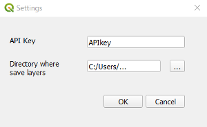
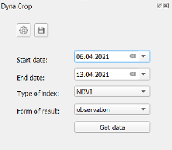

# Plugin QGIS - World from space

## Summary
The plugin connects to the DynaCrop API from World from Space and show environmental earth observation indexes focused to the agriculture area.
## Usage
Each user should have his own API key, which autorize him during using the plugin (registration is solved at World from space). The API key must be put into form, which is available under the button Settings . There could be also set the path to directory, where the results will be saved.

Settings window

Plugin runs with selected polygon or polygons, which should be ready to use in advance. Layer with these selected polygon(s) must be active in Layers window.

Plugin is set via folowing paremeters:
* Start date: Start date for observation period
* End date: End date for observation period
* Type if index: List of available environmental indexes
* Form of result: List of result types. Option Observation will return directly map of selected index. Second option Field zonation provides the same map, where the values are classified into several categories. Third possibility Time series draws the graph, which presents evolution of selected index (average of its values over the selected polygon(s)) in accesible days.  

Main plugin window

Button Get data will run downloading the data accodring to settings. Obtained data (raster layer or graph) are temporary. It could be saved localy by pressing the button Save .